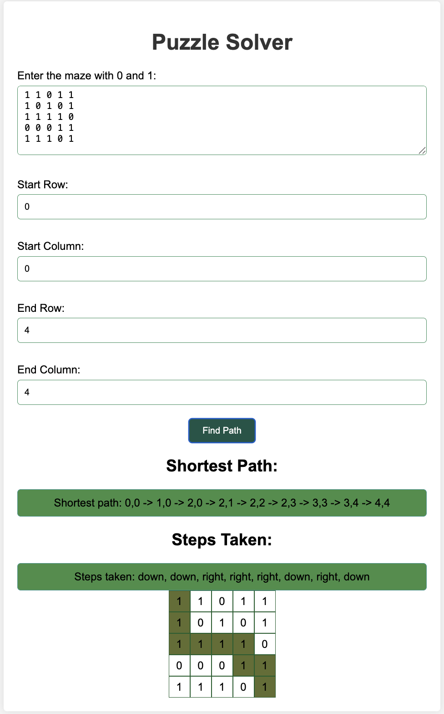

# 🧩 Puzzle Solver - Maze Pathfinding Visualizer

A browser-based web application that solves a maze using the **Breadth-First Search (BFS)** algorithm. Users can input a 2D maze, specify the start and end points, and view the **shortest path and step directions** with a visual representation.

## 📸 Demo



## 🚀 Features

- ✅ Input custom maze using 0s and 1s
- ✅ Specify start and end coordinates
- ✅ Uses BFS to find the shortest path
- ✅ Visual representation of the maze and solution
- ✅ Displays step-by-step directions (up/down/left/right)
- ✅ Responsive and clean UI with modern CSS

## 🧠 How It Works

- **0** → Wall (not walkable)
- **1** → Walkable path
- **Start / End** → Provided by the user
- **BFS Algorithm**:
  - Explores all paths in increasing order of distance
  - Stops as soon as the end is found
  - Ensures the **shortest path**

## 🛠️ Tech Stack

- **HTML5**
- **CSS3**
- **JavaScript (Vanilla)**

## 📥 How to Use

1. Clone this repository:
   ```bash
   git clone https://github.com/yourusername/puzzle-solver.git
   cd puzzle-solver


📈 Future Improvements
  - Add support for diagonal movement
  - Animate path traversal
  - Add input validation for malformed grids
  - Export path as JSON or image

🙋‍♂️ Author
Irfanul Hoda
📧 [irfanulhoda2@gmail.com]
 